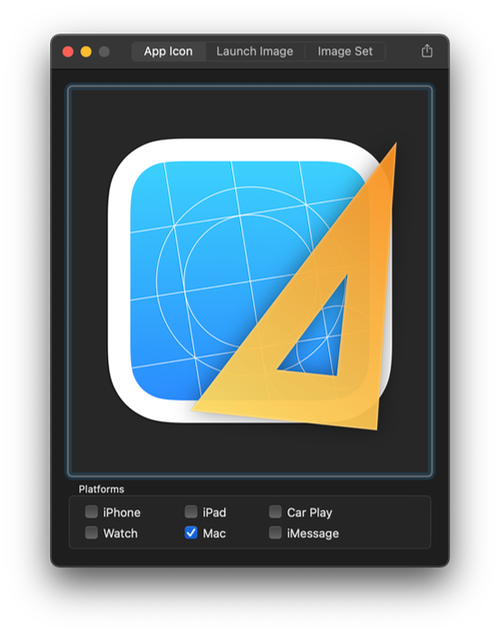

# Iconizer #
Create Xcode image catalogs (xcassets) on the fly. Iconizer builds the necessary file structure for you and generates all required images for App Icons, Launch Images and Image Set.

Visit the [homepage](http://raphaelhanneken.github.io/iconizer/index.html) for more information. 

## How do I install it? ##

1. Download the latest [release](https://github.com/raphaelhanneken/Iconizer/releases) and drop into your Application's folder.
2. Download the source code and it compile yourself.
    - You will need [Carthage](https://github.com/Carthage/Carthage) for this, to install Sparkle.
3. Via Homebrew Cask `brew cask install iconizer`

### Looking for a way to create icns files for OS X? ###
You want to create 1024x1024px retina sized icns for OS X, fast and easily? Make sure to check out [Icns Composer](https://github.com/raphaelhanneken/IcnsComposer)!

----------

## License ##

The MIT License (MIT)

Copyright (c) 2015 Raphael Hanneken

Permission is hereby granted, free of charge, to any person obtaining a copy
of this software and associated documentation files (the "Software"), to deal
in the Software without restriction, including without limitation the rights
to use, copy, modify, merge, publish, distribute, sublicense, and/or sell
copies of the Software, and to permit persons to whom the Software is
furnished to do so, subject to the following conditions:

The above copyright notice and this permission notice shall be included in
all copies or substantial portions of the Software.

THE SOFTWARE IS PROVIDED "AS IS", WITHOUT WARRANTY OF ANY KIND, EXPRESS OR
IMPLIED, INCLUDING BUT NOT LIMITED TO THE WARRANTIES OF MERCHANTABILITY,
FITNESS FOR A PARTICULAR PURPOSE AND NONINFRINGEMENT. IN NO EVENT SHALL THE
AUTHORS OR COPYRIGHT HOLDERS BE LIABLE FOR ANY CLAIM, DAMAGES OR OTHER
LIABILITY, WHETHER IN AN ACTION OF CONTRACT, TORT OR OTHERWISE, ARISING FROM,
OUT OF OR IN CONNECTION WITH THE SOFTWARE OR THE USE OR OTHER DEALINGS IN
THE SOFTWARE.
